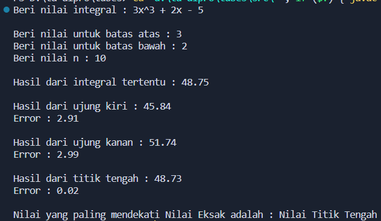
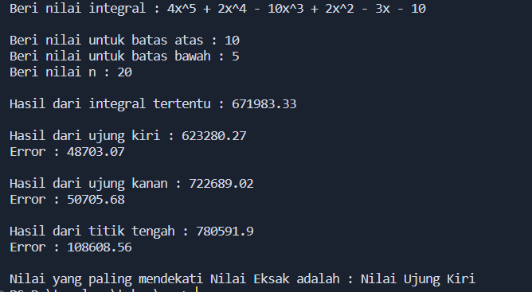

# Menghitung Suatu Luasan Integral

f(x) = 3x^3 + 2x - 5; 2 <= x <= 3

## \*Menghitung Integral Tertentu

- Hampiran Ujung Kiri
- Hampiran Ujung Kanan
- Hampiran Titik Tengah

### Gunakan Method :

- Method Ujung_Kiri
- Method Ujung_Kanan
- Method Titik_Tengah

## Input

- n : Banyak Pias
- a : Batas Bawah
- b : Batas Atas

## Uji Akurasi

Hitung dengan integral tertentu -> _\*Hasil Eksak_  
Hitung error dengan rumus: e = |Hasil eksak - Hasil Pendekatan|  
Hasil Pendekatan = Output dari 3 methode

Amati ketiga error tersebut mana yang paling mendekati _\*Hasil Eksak_

## Hasil

Hasil 1

Hasil 2

